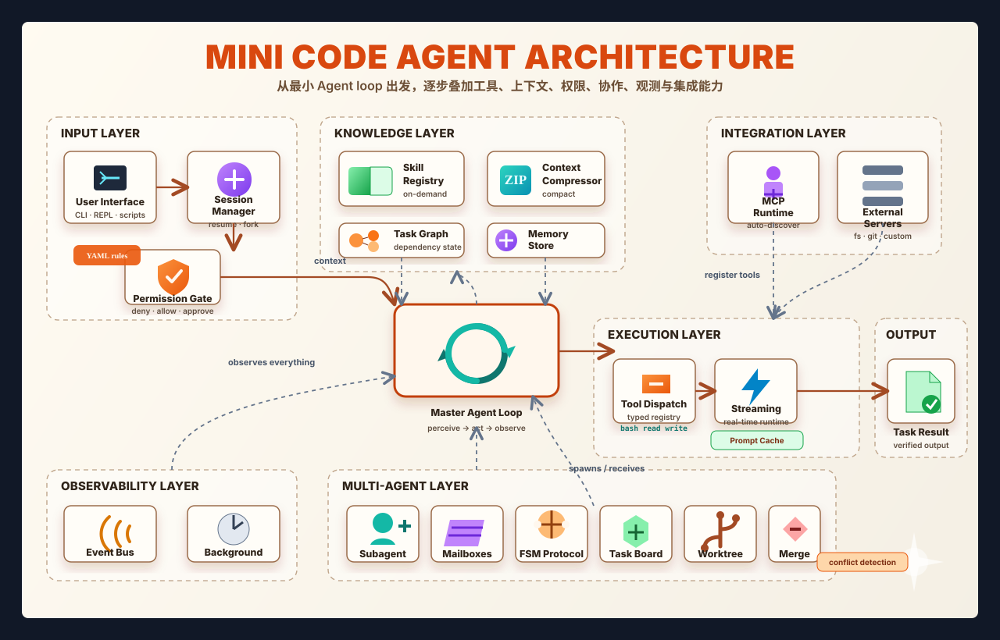

<div align="center">
<h1>Mini Code Agent</h1>

**一个以可运行实现为主线的 Code Agent 工程拆解。**

[](https://python.org)
[](https://anthropic.com)
[](LICENSE)

> 聚焦 Code Agent 的关键工程机制：把核心能力拆开、跑通、验证，并沉淀成可迭代的实现路线。

</div>

---

## 项目定位

`mini-code-agent` 是一个围绕 Code Agent 核心机制展开的渐进式工程实现。项目会把每个能力拆成独立章节：先跑通最小闭环，再逐步加入工具、上下文、权限、状态、协作与外部集成。

每一章都尽量回答三个问题：这个机制解决什么问题，最小实现长什么样，怎样验证它真的生效。模型负责推理和决策，harness 负责执行、约束、连接工具、管理上下文、保存状态，并把每一步结果反馈给模型。

这个项目关注的不是模型本体，而是 Code Agent 外围最关键的工程系统：

- Agent 主循环
- 工具调用与分发
- TodoWrite 任务规划
- 子 Agent 与上下文隔离
- Skill 按需加载
- 上下文压缩与记忆
- 文件读写、命令执行、grep/glob/revert
- 权限治理
- 事件总线
- 会话保存、恢复与分叉
- 并行工具执行
- 中断注入
- Prompt cache 优化
- MCP runtime 集成
- Git worktree 任务隔离

---

## 什么是 Harness Engineering

Harness engineering 指的是构建围绕 AI 模型运行的工程环境，而不是训练模型本身。

模型负责推理、判断和生成下一步动作；harness 负责执行这些动作、限制风险、连接外部世界，并管理模型每一轮能看到的上下文。

一个好的 Agent harness 通常遵循四个原则：

- **模型是唯一的决策来源**：harness 不根据模型输出偷偷改决策，只执行模型明确请求的动作。
- **工具是模型连接世界的唯一接口**：所有外部动作都通过 typed、schema-validated 的工具调用完成。
- **上下文是一种需要管理的资源**：每一轮给模型看的内容都要经过筛选、压缩和有意注入。
- **权限应该声明式配置**：哪些动作允许、拒绝、需要人工确认，应该写在配置里，而不是散落在业务代码里。

---

## 架构概览

一个 Code Agent 可以粗略理解为一条持续运行的闭环：模型读取上下文并决定下一步，harness 校验并执行工具，再把真实结果回填给模型。



这个闭环很小，但所有复杂能力都可以从它长出来：文件编辑、代码搜索、后台任务、子 Agent、会话恢复、MCP、worktree 隔离，本质上都是在这个循环上增加新的工具、状态和治理机制。

---

## 仓库结构

```text
mini-code-agent/
│
├── core.py                          # 单一核心：工具、分发、权限、主循环
│
├── s01_perception_action_loop.py    # 最小感知-行动循环
├── s02_tool_use.py                  # 工具调用与 dispatch map
├── s03_todo_write.py                # TodoWrite：执行前先规划
├── s04_subagent.py                  # 子 Agent：上下文隔离
│
├── s05_skill_loading.py             # 按需加载 SKILL.md
├── s06_context_compact.py           # 三层上下文压缩
├── s07_task_system.py               # 基于文件的任务依赖图
│
├── s08_background_tasks.py          # 后台任务执行
├── s09_agent_teams.py               # 持久化队友与 JSONL 邮箱
├── s10_team_protocols.py            # FSM 团队通信协议
├── s11_autonomous_agents.py         # Agent 自主领取任务
├── s12_worktree_task_isolation.py   # Git worktree 任务隔离
│
├── s13_streaming.py                 # 实时 token streaming
├── s14_tools_extended.py            # 扩展工具与文件快照
├── s15_permissions.py               # YAML 规则驱动的权限治理
├── s16_event_bus.py                 # 事件总线与生命周期 hook
├── s17_session_management.py        # 会话保存、恢复、分叉
│
├── s18_parallel_tools.py            # 使用 asyncio.gather 并行执行工具
├── s19_interrupts.py                # 实时中断注入
├── s20_cache_optimization.py        # Prompt cache 与 KV cache 优化
├── s21_mcp_runtime.py               # 官方 MCP runtime 集成
│
├── s22_production_mailbox.py        # Redis pub/sub 生产级邮箱
├── s23_worktree_advanced.py         # 高级 worktree 生命周期管理
│
├── config/
│   ├── permissions.yaml             # s15、s16 使用的权限规则
│   └── mcp_config.yaml              # s21 使用的 MCP server 注册表
│
├── skills/
│   ├── agent-builder/SKILL.md       # Agent harness 设计模式
│   ├── code-review/SKILL.md         # 结构化代码审查方法
│   └── pdf/SKILL.md                 # PDF 处理方法与库选择
│
├── litellm_config.yaml              # 非 Anthropic 模型的 LiteLLM 代理配置
└── requirements.txt                 # 项目依赖
```

---

## 快速开始

### 方式 A：直接使用 Anthropic

```bash
# 1. 克隆仓库
git clone git@github.com:CharmingZhou/mini-code-agent.git
cd mini-code-agent

# 2. 创建虚拟环境
python -m venv .venv
source .venv/bin/activate        # Linux / macOS
.venv\Scripts\activate           # Windows

# 3. 安装依赖
pip install -r requirements.txt

# 4. 配置环境变量
cp .env.example .env
# 编辑 .env，填入 ANTHROPIC_API_KEY 和 MODEL_ID
```

`.env` 示例：

```env
ANTHROPIC_API_KEY=sk-ant-your-key-here
MODEL_ID=claude-sonnet-4-20250514
```

运行任意章节：

```bash
python s01_perception_action_loop.py
python s03_todo_write.py
python s17_session_management.py
```

---

### 方式 B：通过 LiteLLM 使用其他模型

这个项目也可以通过 LiteLLM proxy 接入其他模型提供商，例如 OpenAI、DeepSeek、Groq、Mistral、Nebius 或任意 OpenAI-compatible endpoint。

好处是：Agent 代码仍然使用 Anthropic SDK 风格调用，LiteLLM 在中间负责协议转换。

**步骤 1：安装 LiteLLM**

```bash
pip install 'litellm[proxy]'
```

**步骤 2：配置 `litellm_config.yaml`**

```yaml
# 示例：OpenAI
model_list:
  - model_name: my-model
    litellm_params:
      model: openai/gpt-4o
      api_key: os.environ/OPENAI_API_KEY

# 示例：DeepSeek
model_list:
  - model_name: my-model
    litellm_params:
      model: deepseek/deepseek-chat
      api_key: os.environ/DEEPSEEK_API_KEY
```

**步骤 3：启动 LiteLLM proxy**

```bash
litellm --config litellm_config.yaml --port 4000
```

**步骤 4：让 `.env` 指向 proxy**

```env
ANTHROPIC_BASE_URL=http://localhost:4000
ANTHROPIC_API_KEY=dummy-key-litellm-ignores-this
MODEL_ID=my-model
OPENAI_API_KEY=your-real-provider-key-here
```

**步骤 5：正常运行任意章节**

```bash
python s03_todo_write.py
```

---

## 核心基础

所有章节文件都从 `core.py` 导入公共能力，避免在每个文件里重复实现。

```python
from core import (
    client, MODEL, DEFAULT_SYSTEM,          # Anthropic client 与配置
    EXTENDED_TOOLS, EXTENDED_DISPATCH,      # 工具定义与处理函数
    run_bash, run_read, run_write,          # 同步工具实现
    async_bash, async_read, async_write,    # 异步工具实现
    load_rules, check_permission,           # 权限治理
    stream_loop, dispatch_tools,            # 主循环辅助函数
)
```

`core.py` 是整个项目的地基；每个 `sXX_*.py` 文件只引入一个新机制。这样实现路径更清晰：先理解最小闭环，再逐步叠加能力。

---

## 模块 1：核心 Agent 循环

Agent loop 是所有能力的起点。它本质上是一个 while 循环：调用模型，观察模型是否要使用工具，执行工具，再把结果交还给模型。

| 文件 | 机制 | 对应能力 |
|------|------|------------------|
| `s01_perception_action_loop.py` | 最小 while loop | 执行闭环 |
| `s02_tool_use.py` | 工具名到处理函数的 dispatch map | 工具注册与分发 |
| `s03_todo_write.py` | TodoWrite：执行前先规划 | 计划先行 |
| `s04_subagent.py` | 子 Agent：隔离子任务上下文 | 上下文隔离 |

```bash
python s01_perception_action_loop.py    # 从这里开始，理解最小循环
python s02_tool_use.py                  # 加入工具分发
python s03_todo_write.py                # 加入执行前规划
python s04_subagent.py                  # 加入上下文隔离
```

---

## 模块 2：知识与上下文管理

这一阶段让 Agent 不再只是单轮执行器，而是开始具备长期任务需要的认知基础：按需加载知识、压缩上下文、持久化任务状态。

| 文件 | 机制 | 对应能力 |
|------|------|------------------|
| `s05_skill_loading.py` | 按需注入 `SKILL.md` | 按需知识注入 |
| `s06_context_compact.py` | 三层压缩与磁盘记忆 | 上下文压缩器 |
| `s07_task_system.py` | 文件持久化任务依赖图 | 任务依赖管理 |

```bash
python s05_skill_loading.py             # 按需加载 skills
python s06_context_compact.py           # 压缩上下文并保存记忆
python s07_task_system.py               # 使用任务图管理依赖
```

内置 skills：

```text
skills/agent-builder/   # harness 设计模式与工具检查清单
skills/code-review/     # 结构化 5 步代码审查方法
skills/pdf/             # PDF 处理库选择与代码模式
```

---

## 模块 3：异步执行与多 Agent 协作

这一阶段突破单 Agent 的限制：慢任务可以后台运行，专家 Agent 可以通过 mailbox 协作，任务可以被自主领取，多个任务可以用 git worktree 隔离执行。

| 文件 | 机制 | 对应能力 |
|------|------|------------------|
| `s08_background_tasks.py` | daemon thread 与通知队列 | 异步队列 |
| `s09_agent_teams.py` | 持久化队友与 JSONL mailbox | 角色化协作 |
| `s10_team_protocols.py` | FSM：IDLE -> REQUEST -> WAIT -> RESPOND | 工具调用协调 |
| `s11_autonomous_agents.py` | Agent 从任务板自主领取任务 | 更进一步的自治模式 |
| `s12_worktree_task_isolation.py` | 每个并行任务一个 git worktree | 任务隔离 |

```bash
python s08_background_tasks.py          # 后台执行
python s09_agent_teams.py               # 持久化专家队友
python s10_team_protocols.py            # FSM 协作协议
python s11_autonomous_agents.py         # 自主领取任务
python s12_worktree_task_isolation.py   # Git worktree 隔离
```

---

## 模块 4：工程化加固

工作 Agent 和可部署 Agent 之间差的不是一个 prompt，而是一整套工程加固：实时输出、可回滚文件操作、声明式权限、生命周期事件、可恢复会话。

| 文件 | 机制 | 对应能力 |
|------|------|------------------|
| `s13_streaming.py` | 实时 token streaming | 实时反馈 |
| `s14_tools_extended.py` | read/write/grep/glob/revert | 扩展工具集 |
| `s15_permissions.py` | YAML 三层信任系统 | 权限治理 |
| `s16_event_bus.py` | 生命周期 hook | 生命周期扩展 |
| `s17_session_management.py` | `:resume`、`:fork`、`:sessions` | 会话持久化 |

```bash
python s13_streaming.py                 # 实时流式输出
python s14_tools_extended.py            # 扩展工具集
python s15_permissions.py               # 权限治理
python s16_event_bus.py                 # 事件总线与 hooks
python s17_session_management.py        # 会话持久化
```

`s17` 支持的会话命令：

```text
s17 >> :sessions          # 列出所有保存过的会话
s17 >> :resume <id>       # 继续某个历史会话
s17 >> :fork <id>         # 从旧会话分叉出独立新会话
s17 >> :title <text>      # 重命名当前会话
s17 >> :save              # 手动保存
```

`config/permissions.yaml` 中的权限层级：

```yaml
always_deny:   rm -rf / · sudo · pipe-to-shell downloads
always_allow:  ls · cat · git status · grep · version checks
ask_user:      rm · git commit · pip install · .env access
```

---

## 模块 5：高性能异步 Runtime

这一阶段关注性能与可控性：并行工具调用减少等待时间，中断注入让人类可以实时修正方向，prompt caching 降低重复 token 成本，MCP 让 Agent 可以接入任意外部工具服务器。

| 文件 | 机制 | 对应能力 |
|------|------|------------------|
| `s18_parallel_tools.py` | `asyncio.gather` 并行执行所有工具调用 | 并行工具执行 |
| `s19_interrupts.py` | Ctrl+C 中途注入用户指令 | 实时转向队列 |
| `s20_cache_optimization.py` | Prompt caching HIT/MISS 追踪 | 上下文复用 |
| `s21_mcp_runtime.py` | 官方 MCP SDK 自动注册工具 | 外部工具集成 |

```bash
python s18_parallel_tools.py            # 并行工具执行
python s19_interrupts.py                # 实时中断注入
python s20_cache_optimization.py        # Prompt caching
python s21_mcp_runtime.py               # MCP runtime
```

Cache 输出示例：

```text
[cache] MISS -> 1,847 tokens written
[cache] HIT  -> 1,847 tokens read (saved ~1,662 tokens)
[cache summary] 6 calls | written=1,847 | hits=5 | total saved≈8,310 tokens
```

在 `config/mcp_config.yaml` 中添加 MCP servers：

```yaml
servers:
  - name: filesystem
    transport: stdio
    command: npx
    args: ["-y", "@modelcontextprotocol/server-filesystem", "."]

  - name: git
    transport: stdio
    command: uvx
    args: ["mcp-server-git"]
```

---

## 模块 6：运行时升级

这一阶段把教学实现替换成更接近生产环境的版本：Redis pub/sub 替代 JSONL mailbox，高级 worktree 生命周期管理覆盖更多边界情况。

| 文件 | 机制 | 升级点 |
|------|------|--------|
| `s22_production_mailbox.py` | Redis pub/sub channels | 替代 s09 JSONL mailbox |
| `s23_worktree_advanced.py` | 完整 worktree 生命周期管理 | 替代 s12 基础 worktree |

```bash
# 先启动 Redis
docker run -p 6379:6379 redis

python s22_production_mailbox.py        # Redis mailbox，Redis 不可用时回退到 Queue
python s23_worktree_advanced.py         # 高级 worktree 管理
```

`s23` 覆盖的边界情况：

```text
✓ 脏工作区警告
✓ 过期 worktree 清理
✓ 分支名冲突解决
✓ detached HEAD 检测
✓ 并行冲突检测
✓ try/finally 保证清理
```

---

## 后续可以继续改进的方向

1. **并行生成子 Agent**：把 `spawn_subagent` 改成 `asyncio.gather`，一次启动多个探索型 subagent。
2. **向量记忆库**：用 ChromaDB 替代扁平 markdown memory，实现语义检索，而不是每次注入完整摘要。
3. **更细粒度的 token 账本**：按任务、工具类型、模型调用记录成本，定位最贵的操作。
4. **Webhook 事件总线**：把事件转发到 Slack、Datadog、PagerDuty 等外部系统，而不改主循环。
5. **LLM-as-a-Judge 评估层**：从准确性、工具效率、计划遵循度等维度评价 Agent 输出，让项目可以变成 benchmark。

---

## 依赖

```bash
pip install -r requirements.txt
```

| Package | 使用位置 | 作用 |
|---------|----------|------|
| `anthropic>=0.40.0` | 所有章节 | Anthropic SDK |
| `python-dotenv>=1.0.0` | 所有章节 | 加载 `.env` |
| `colorama>=0.4.6` | 所有章节 | Windows ANSI 颜色兼容 |
| `PyYAML>=6.0.1` | s15、s16、s21 | YAML 配置解析 |
| `mcp>=1.0.0` | s21 | 官方 MCP SDK |
| `redis>=5.0.0` | s22 | Redis pub/sub，失败时回退到 Queue |
| `litellm[proxy]>=1.50.0` | 可选 | 支持非 Anthropic 模型 |

---

## 实现路线建议

如果你是第一次实现 Code Agent，建议按这个顺序推进：

1. 先只实现 `s01`：理解模型、工具、结果回填这个最小循环。
2. 再实现 `s02` 到 `s04`：工具分发、TodoWrite、subagent 是核心骨架。
3. 然后实现 `s05` 到 `s07`：让 Agent 有知识加载、上下文压缩和任务状态。
4. 接着实现 `s13` 到 `s17`：优先做 streaming、权限、session，这些最贴近真实使用体验。
5. 最后再做 `s18` 到 `s23`：并行、MCP、Redis、worktree 属于高级扩展。

目标不是一次性堆完所有功能，而是每一章都问清楚：这个机制解决了 Agent 的哪个具体痛点？如果没有它，系统会在哪里坏掉？

---

## 参考资料

- [FareedKhan-dev/claude-code-from-scratch](https://github.com/FareedKhan-dev/claude-code-from-scratch)
- [shareAI-lab/learn-claude-code](https://github.com/shareAI-lab/learn-claude-code)
- Anthropic Claude Code、Agent Skills、MCP 等公开产品与文档

说明：本项目是面向 Code Agent 机制的工程实现与笔记整理，不是 Anthropic 官方 Claude Code，也不包含官方源码。
